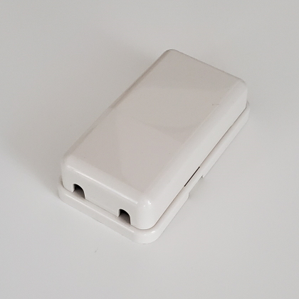

# Daikin "remote control adapter" reverse engineering
Here you will find the result of my reverse engineering of a small adapter sold with Daikin wired remote controls for consumer oriented air conditioners.  
Daikin calls this adapter a "remote control adapter" and it hasn't any part number neither is sold separately.
  

## Backstory
In order to reverse engineer the communication protocol of the Daikin air conditioner installed in my bedroom, I purchased a second hand wired remote control.
Unfortunately, the original attachments were missing and the cable that came with the air conditioner didn't fit the connector of the wired remote control.  
I downloaded the installation manual and discovered the wired remote control doesn't connect directly to the air conditioner:  
**wired remote control** -*("remote controller cord")*-> "**remote control adapter**" -*(cable delivered with air conditioner)*-> **air conditioner**  
While the "remote controller cord" is sold separately, there was no part number or information for buying this "remote control adapter".
After inquiring Daikin customer service, they confirmed me it is not sold separately and the only way to obtain one is to buy a brand new wired remote control.
I easily found sites where to buy the "remote controller cord" but spent almost two months looking at selling ads for wired remote control, until I found someone willing to sell me only the "remote control adapter".

## Photos
I uploaded a few photos of the "remote control adapter" I got, including:  
・inside of the adapter  
・PCB top side  
・PCB bottom side  

## Schematic
Along with KiCad files, I also created a PDF version. Only a few capacitor values are missing.

## BOM
Since I managed to identify all components, I created a bill of material.

## Datasheets
Compilation of datasheets of the main components for reference.

## Other
The number on the PCB top side (3P071086) returned a few results on Google so it could be a part number.
